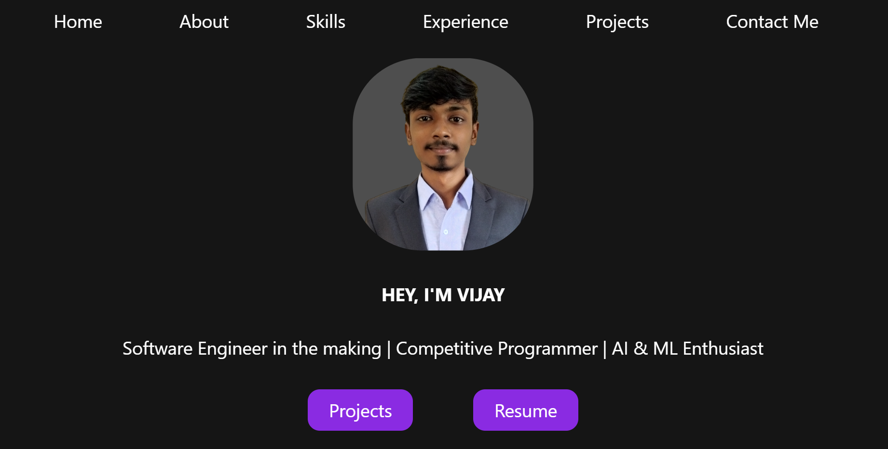

# My Portfolio Website

Welcome to my personal portfolio — a minimalist, responsive website built using **pure HTML and CSS**. This site showcases who I am, what I build, and where I’m headed as a developer.

## About Me
I'm Vijay, a Computer Science (AI & ML) student with a strong passion for problem-solving, building real-world projects, and competitive programming. With 600+ problems solved and 60+ contests participated in, I'm constantly leveling up to become a software engineer at a top product-based company.

## Features

- Sections: Home, About Me, Skills, Projects, Contact
- navbar to smooth scrolling
- No JavaScript — built using only HTML & CSS

## Tech Stack

- HTML5
- CSS3

